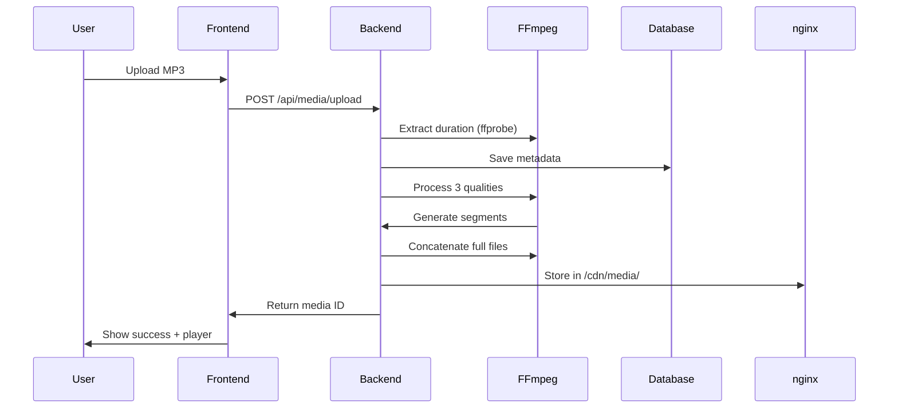
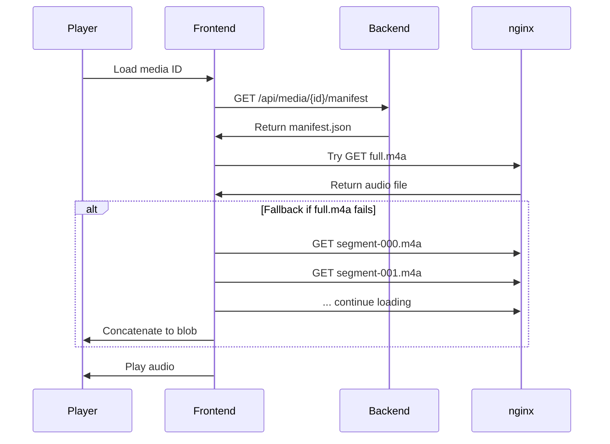

# 2. Arquitetura do Sistema

## 🏗️ Estrutura Geral

```
streamLocal/
├── apps/
│   ├── web/                 # Frontend Next.js
│   │   ├── src/
│   │   │   ├── app/         # App Router pages
│   │   │   ├── components/  # React components
│   │   │   └── lib/         # Utilities
│   │   └── package.json
│   └── server/              # Backend Fastify
│       ├── src/
│       │   ├── routes/      # API endpoints
│       │   └── index.ts     # Server setup
│       └── mnt/data/        # File storage
├── packages/
│   └── db/                  # Database layer
│       ├── prisma/          # Schema & migrations
│       └── src/             # DB utilities
└── docker-compose.yml       # nginx CDN
```

## 🔄 Fluxo de Dados Detalhado

### 1. Upload e Processamento



### 2. Streaming e Reprodução



## 🧩 Componentes Principais

### Frontend (Next.js)

#### Páginas
- **`/`**: Homepage com upload
- **`/library`**: Dashboard de mídia
- **`/player/[id]`**: Player individual

#### Componentes Chave
- **`PlayerSimple`**: Player de áudio principal
- **`UploadForm`**: Interface de upload
- **`MediaList`**: Lista de arquivos

#### Utilitários
- **`fetchManifest`**: Busca metadata do backend
- **`uploadFile`**: Handle de upload

### Backend (Fastify)

#### Rotas Principais
```typescript
// Upload e processamento
POST /api/media/upload
GET  /api/media/{id}/manifest
GET  /api/media

// Processamento interno
POST /api/process (interno)
```

#### Processamento FFmpeg
```bash
# Extração de duração
ffprobe -v quiet -show_entries format=duration -of csv=p=0 input.mp3

# Segmentação por qualidade
ffmpeg -i input.mp3 -vn -acodec aac -ab 160k \
       -f segment -segment_time 5 -reset_timestamps 1 \
       output/segment-%03d.m4a

# Concatenação
ffmpeg -f concat -safe 0 -i filelist.txt -c copy full.m4a
```

### Database (PostgreSQL + Prisma)

#### Schema Principal
```prisma
model Media {
  id          String   @id @default(cuid())
  title       String
  filename    String
  size        Int
  duration    Float?   // Duração em segundos
  processed   Boolean  @default(false)
  qualities   Json?    // Qualidades disponíveis
  createdAt   DateTime @default(now())
  updatedAt   DateTime @updatedAt
}
```

### CDN (nginx)

#### Configuração
```nginx
server {
    listen 8080;
    location /cdn/media/ {
        alias /app/media/chunks/;
        add_header 'Access-Control-Allow-Origin' '*';
        add_header 'Access-Control-Allow-Methods' 'GET, OPTIONS';
    }
}
```

## 🔌 APIs e Contratos

### Manifest Format
```json
{
  "id": "cmhmthgzy0000i0cguyh7gt40",
  "title": "Song.mp3",
  "duration": 339.09551,
  "qualities": {
    "96k": {
      "url": "/cdn/media/id/audio-96k/",
      "segments": 68
    },
    "160k": {
      "url": "/cdn/media/id/audio-160k/",
      "segments": 68
    },
    "320k": {
      "url": "/cdn/media/id/audio-320k/",
      "segments": 68
    }
  },
  "createdAt": "2025-11-06T02:38:09.743Z"
}
```

### File Structure per Media
```
/cdn/media/{mediaId}/
├── audio-96k/
│   ├── segment-000.m4a
│   ├── segment-001.m4a
│   ├── ...
│   └── full.m4a
├── audio-160k/
│   └── ... (same structure)
├── audio-320k/
│   └── ... (same structure)
└── manifest.json
```

---

➡️ **Próximo**: [Setup & Instalação](./03-SETUP.md)